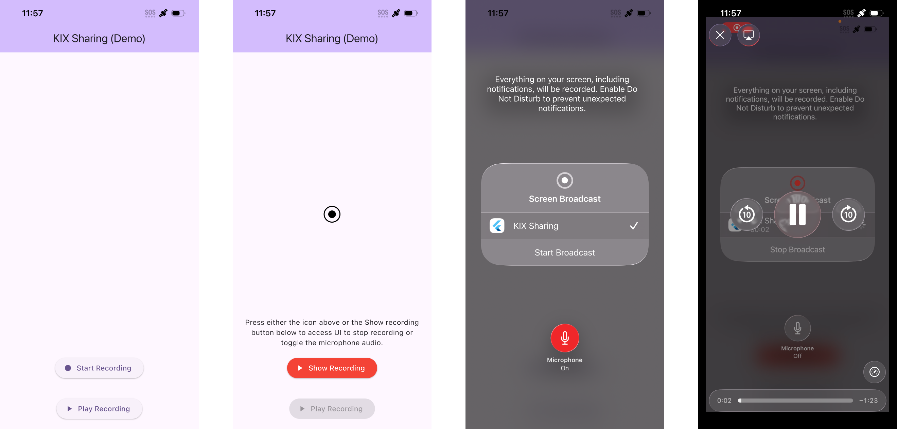

# Screen Recorder Proof-of-Concept

This demo app demonstrates some screen recording capabilities on iOS for the next generation of "KIX sharing" project. It allows users to record their screen activities and save them as video files locally in the app, then view the recordings.

## App Screenshots

## High Level requirements

The new app will be branded as "KIX Sharing". The app is built to demonstrate the following requirements:

Create a sample app that will do the following tasks:

- App should have a button to record a screen share
- App should record the video for current share
- App should rename / overwrite default Broadcast message to KIX sharing
- App should ask for option to mute /un-mute audio

Clarifications received during the call:

- iOS only
- System-wide screen recording
- Local storage of recorded video
- No need to upload anywhere
- Local playback is desirable
- Available packages do not satisfy the requirement to mute/un-mute audio, so custom implementation is needed
- If possible, mute/unmute experience during recording should be explored and if possible improved
- No UI styling to implement
- Minimal architecture patterns
- Quality of code

## Architecture

- The app is built according to MVVM architecture pattern that has been recommended by Google only recently (November 2025, as far as I can remember) [https://docs.flutter.dev/app-architecture](https://docs.flutter.dev/app-architecture). I have been practicing MVVM pattern since 2009 when Microsoft introduced it as part of Prism practices. Its been the core of all mobile projects that I have built in the last 15 years, and now a de-facto standard across all mobile stacks including native Swift and Kotlin. In combination with Clean Architecture this would provide the best possible framework that is scalable, testable and maintainable.
- The app uses layered architecture to separate concerns and improve maintainability. The layers are implemented as folders, however, in production should be considered as internal packages, that promote greater separation of concerns, dependency hierarchy and maintainability. CLI tools like `melos` can be used to orchestrate build commands, however, using Makefile, or shell scripts is also a good option.
- SOLID principles applied throughout to achieve clean code, testability and maintainability.
- "Bloc" design pattern using `flutter_bloc` is used for state management with `Cubit` used for main scenarios and `Bloc` for event-driven complex use cases. Both, drive UI updates via the stream of state events emitted to the widget tree.
- "GetIt" (`get_it`) package is used for dependency injection within the scope of SOLID principles.
- Code linting using `lint` and static code analyzer `analyzez` are used in the project.
- `equatable` package is used to implement equality in model classes, such as ViewModel states, entities, etc.
- Barrel files in the root of the package for layer imports.
- `ReplayKit` with `BroadcastUploadExtension` capability for operating screen recording at system level.

## App layers

- Abstract: Contains abstract classes, interfaces and entities for the app.
- Model: Represents the data and business logic of the application.
- Domain: Could be optionally added for complex business logic and use cases.
- ViewModel: Acts as a bridge between the Model and the View, handling data transformations and UI logic.
- View: The UI components that display the data and interact with the user.

## Features implemented

1. Main structure of the app that is aligned with the architecture.
1. `HomePage` screen with "Start recording", "Stop recording" buttons and "Play recording" buttons.
1. Visibility of the buttons and enabled status are controlled via statuses controlled by the "HomePageViewModel". Not 100% operational due to lack of observability.
1. A simple `ScreenRecordingMethodChannel` method channel is implemented in the "Model" layer with funcionality represented.
1. The method channel is wired up and implemented in the `ios/Runner/AppDelegate.swift`, however should be moved into a separate class for best practice.
1. Screen recording initiation via the `RPSystemBroadcastPickerView` from the main app and implemented in the `AppDelegate.swift`.
1. Recording using "Broadcast Upload Extension" capability with branding configured to match the app name "KIX Sharing"
1. The video recording is stored using `AVAssetWriter` into the app's local storage of the `BroadCast` extension, and then copied to the App Group container for access by the main app.
1. The system "Broadcast UI" control button (black/red target image) is positioned in the middle and can either be interacted with or hidden.
1. The "Show recording" button can be pressed one, once recording is in progress, and this will bring up the recording UI, however, current behavior is not robust due to not implemented observability of the recording and playback status.
1. The visibility of the "Play recording" button is implemented using a simple polling mechanism in the "HopePageViewModel" with 2 secs interval, however, no observability is implemented due to time constraints.
1. Microphone audio toggle before recording. The app remembers the last setting, e.g. Mic = ON.
1. BONUS: The video recording can be played back using `AVPlayer` API when "Play recording" button is visible.

## Not implemented

- UI styling, as per the requirement.
- Observable pattern to monitor recording status in the "Home Page" screen, due to timeframe constraints of this POC. This would require implementation of Platform Event Channel wired up to the Broadcast Extension to monitor recording status and update the UI accordingly. Button statuses are simulated with delays for demo purposes, however, a better alignment is needed when integrating with.
- Toggling microphone during the recording session, due to limited time. However one of ideas that I had is to explore "Dynamic Island" APIs and setting `RPScreenRecorder.shared().isMicrophoneEnabled` property from the `HomePage` UI or via "Dynamic Island" interaction.
- Sharing of the recorded video, due to timeframe constraints of this POC. Straightforward implementation could be achieved using `UIActivityViewController`.
- Multiple recordings, as no requirement, and essentially require a recording browsing UI.
- Unit testing, due to timeframe constraints of this POC, however, `Model`, `Domain`, `ViewModel` and `Abstracts` layers should aim for 100% test coverage, where widgets placed in the View Layer should also be considered for testing.
- Audio manipulation

## TODOs

- Explore "Dynamic Island" APIs to place an icon in the dynamic island, e.g. a Microphone icon that could be triggered to bring the KIX app to the foreground and toggle the microphone. Ideally the Dynamic Island trigger would toggle the audio mute setting. 
- Explore "Broadcast Setup UI extension" for further possibilities to improve UX
- Explore the `ReplayKit` options for better mute control during recording
- Implement "ScreenRecordingEventChannel" with event providing status of the recording and presence of the recording file.
- Tidy up button behavior in the `HomePage`
- Explore better handling of audio stream.
